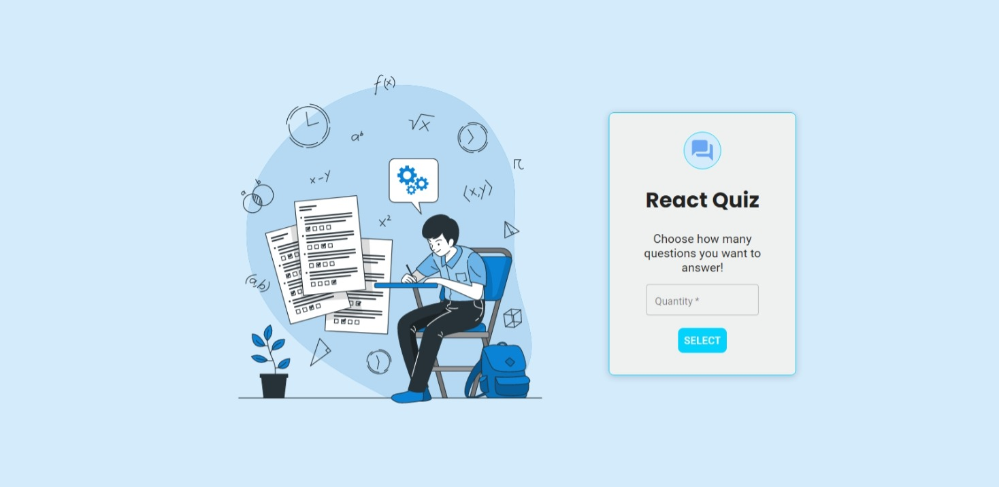
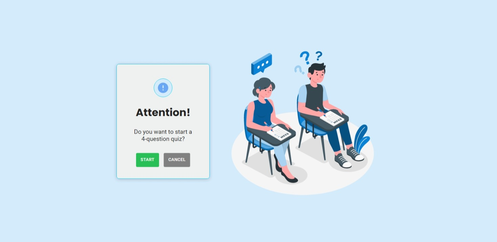
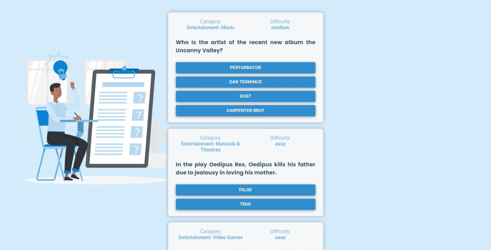
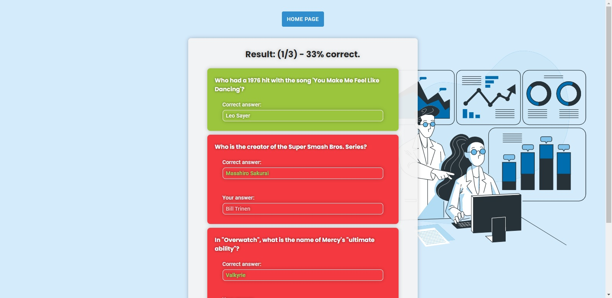

<h1 align="center">
  React Quiz
</h1>

<h3 align="center">
  Application preview:
  <a href="http://react-quiz-bice.vercel.app/">
    React Quiz
  </a>
</h3>

 

  

 

## About the project

This project aims to create an application where the user can answer questions about general knowledge. Where he just needs to choose the amount of questions he wants, and then go to answer them. At the end, a report of your results will be shown.

 

## 🚀 Technologies Used

- [Node.js](https://nodejs.org/en)
- [TypeScript](https://www.typescriptlang.org)
- [ReactJS](https://reactjs.org)
- [React Hooks](https://reactjs.org/docs/hooks-intro.html)
- [React Context API](https://reactjs.org/docs/context.html)
- [React Router DOM](https://reactrouter.com/web/guides/quick-start)
- [Styled Components](https://styled-components.com/docs)
<!-- - [React Hot Toast](https://react-hot-toast.com) -->

 

## 🎨 Layout preview

<!-- 🏗️👷‍♂️🚧⚠️ Em construção...⚠️🚧👷‍♂️🏗️ -->

 

## ✅ Feature

- [x] When accessing the page, the user must choose the number of questions he wants to answer.
- [x] After choosing, a page should appear with two buttons, “Start” and “Cancel”.
- [x] When selecting “Cancel”, it must return to choose the quantity.
- [x] When selecting "Start" you must make a request at the URL provided, get the questions and for each question, you must display the answers.
- [x] The user must choose an answer and for each answer must count the number of hits and errors.
- [x] At the end, there should be a report with the number of successes and errors and a list of each question and which was right and which was wrong.
- [x] In this list the chosen answer and the correct answer must also appear.
- [x] Score must be stored in localStorage.
- [x] On the first page and if there is a quiz saved in localStorage, there should be a possibility to review this report result.

 

 

# 😯 How to contribute to the project

1. Fork the project, and create a Branch for your Feature (git checkout -b feature/AwesomeFeature)
2. Add your changes (git add .)
3. Commit your changes (git commit -m 'Adding an awesome Feature!)
4. Push the Branch (git push origin feature/AwesomeFeature)
5. Open a Pull Request

> If you have any questions check out this [How to contribute on GitHub guide](https://github.com/firstcontributions/first-contributions)

---

<h4 align="center">
    Made with 💜 by Maycon Gorgonha 👋🏽 <a href="https://www.linkedin.com/in/maycon-gorgonha/" target="_blank">Get in touch!</a>
<h4>

MIT License © <a href="https://github.com/maycongc">Maycon Gorgonha</a>

